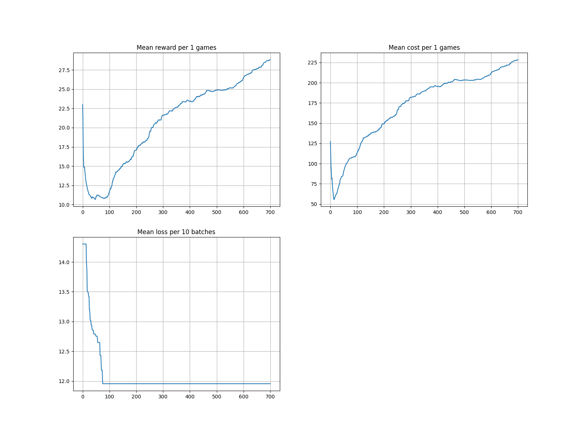

# irl-es
- inverse reinforcement learning for control through evolutionary strategies

## Demonstration Trajectory Generation 

For generating demonstration for toy control problems through trajectory optimization, we use pydrake. This custom [colab notebook](https://colab.research.google.com/drive/14D8u36RauNort_PMrUYHtL7BTLVy290h?usp=sharing) comprises of the i)setup ii) trajectoy generation iii) Visualisation and iv) other boiler plates. At present it is ready for pendulumn, and one can easily download a zipped folder of the trajectory for a given set of dynamics and simulation config.


# Guided Cost Learning
This repo is a working implementation of guided cost learning (https://arxiv.org/abs/1603.00448) for discrete action space. Currently, it supports the `CartPole-v0` environment.

## How to run:

```bash
$ python3.8 main.py 

```

## Description of files:
- [generating_expert.py](generating_expert.py): Generates an expert on CartPole, by training vanilla policy gradient, and finally stores trained trajecteries as expert samples at [expert_samples](expert_samples).
- [experts/PG.py](experts/PG.py): Implementation of vanilla policy gradient. This is reused at several places.
- [main.py](main.py): Contains the main implementation of GCL.

## Results:

